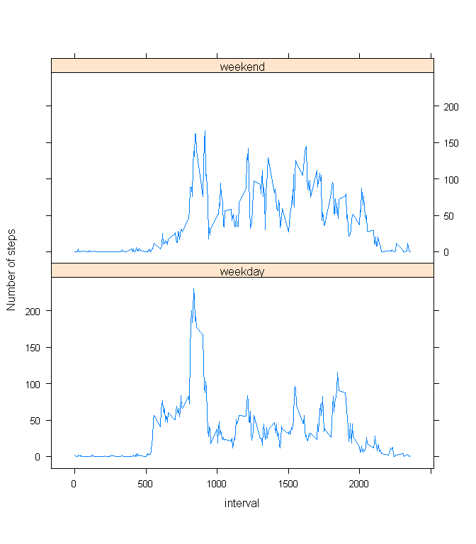

# Reproducible Research: Peer Assessment 1

First of all we seting up knitr parameters to store plot pictures in "./figure/" directory.
Acctually this is a system directory, but task for this assignment tell us: "always use ```echo = TRUE```".

```r
require(knitr)
opts_knit$set(root.dir = ".")
opts_chunk$set(fig.path = "./figure/",dev="png") 
```


## Loading and preprocessing the data
1. Load the data
1. Process/transform the data (if necessary) into a format suitable for your analysis


```r
require(data.table)
```

```
## Loading required package: data.table
```

```r
data<-read.table(
    unz("activity.zip", "activity.csv"),
    header=T,sep=",",quote="\"",na.strings = "NA",
    colClasses=c("numeric","Date","numeric"),
    col.names=c("steps","date","interval"))
data<-data.table(data)
summary(data)
```

```
##      steps             date               interval     
##  Min.   :  0.00   Min.   :2012-10-01   Min.   :   0.0  
##  1st Qu.:  0.00   1st Qu.:2012-10-16   1st Qu.: 588.8  
##  Median :  0.00   Median :2012-10-31   Median :1177.5  
##  Mean   : 37.38   Mean   :2012-10-31   Mean   :1177.5  
##  3rd Qu.: 12.00   3rd Qu.:2012-11-15   3rd Qu.:1766.2  
##  Max.   :806.00   Max.   :2012-11-30   Max.   :2355.0  
##  NA's   :2304
```

## What is mean total number of steps taken per day?
For this part of the assignment, you can ignore the missing values in the dataset.

1.  Calculate the total number of steps taken per day
1.  If you do not understand the difference between a histogram and a barplot, research the difference between them. Make a histogram of the total number of steps taken each day
1.  Calculate and report the mean and median of the total number of steps taken per day

Using power of ```data.table``` and ```dplyr``` package to answer on question. After that plotting frequency histogram of total number of steps taken each day. Mean and Median represented on the graph as red and green line correspondingly. 


```r
require(data.table)
require(dplyr)
data1 <- data
dataGroup1 <- data1 %>%
                group_by(date) %>%
                    summarise(steps=sum(steps,na.rm=T))
with(dataGroup1,{
hist(steps,breaks=50,xlab="Steps",main="Total number of steps taken per day")
abline(v=mean(steps),col="red")
abline(v=median(steps),col="green")
legend("topright",
       lty=1,
       col = c("red", "green"),
       cex=.7,
       legend=c(
         paste("Mean:",as.character(round(mean(steps)))),
         paste("Median:",as.character(round(median(steps))))
         )
       )
})
```

 

Clear


```r
rm(data1,dataGroup1)
```

## What is the average daily activity pattern?
1.  Make a time series plot (i.e. ```type = "l"```) of the 5-minute interval (x-axis) and the average number of steps taken, averaged across all days (y-axis)
2.  Which 5-minute interval, on average across all the days in the dataset, contains the maximum number of steps?

Again using ```data.table``` and ```dplyr``` packages to deal with data and plotting the graph. Max value of ```steps``` and corresponding ```interval``` value shown in legend.


```r
require(data.table)
require(dplyr)
data2 <- data
dataGroup2 <- data2 %>%
                group_by(interval) %>%
                    summarise(steps=mean(steps,na.rm=T))
with(dataGroup2,{
plot(x=interval,
      y=steps, 
      type="l",
      main="Average daily activity pattern",
      xlab="Interval",
      ylab="Steps")
legend("topright",
       bty="n",
       legend=c(
         paste("Max Steps:",round(max(steps),2),"\n",
               "Interval Value:",dataGroup2[which.max(steps)][["interval"]]
         )
       ))
})
```

 

Clear


```r
rm(data2,dataGroup2)
```

## Imputing missing values
Note that there are a number of days/intervals where there are missing values (coded as NA). The presence of missing days may introduce bias into some calculations or summaries of the data.

1.  Calculate and report the total number of missing values in the dataset (i.e. the total number of rows with NAs)

Just doing that.


```r
totalMissingValues<-sum(!complete.cases(data))
```
The value of total number of missing values in the data set is **2304**.

2.  Devise a strategy for filling in all of the missing values in the dataset. The strategy does not need to be sophisticated. For example, you could use the mean/median for that day, or the mean for that 5-minute interval, etc.
3.  Create a new dataset that is equal to the original dataset but with the missing data filled in.

Filling NA values in ```steps``` with mean of 5 minute ```interval```. After that grouping data set by ```date``` and getting the sum of ```steps``` using ```dplyr``` package.


```r
require(data.table)
require(dplyr)
data3 <- data
data3[,steps:=ifelse(is.na(steps),mean(steps,na.rm=T),steps),by="interval"]
```

```
##            steps       date interval
##     1: 1.7169811 2012-10-01        0
##     2: 0.3396226 2012-10-01        5
##     3: 0.1320755 2012-10-01       10
##     4: 0.1509434 2012-10-01       15
##     5: 0.0754717 2012-10-01       20
##    ---                              
## 17564: 4.6981132 2012-11-30     2335
## 17565: 3.3018868 2012-11-30     2340
## 17566: 0.6415094 2012-11-30     2345
## 17567: 0.2264151 2012-11-30     2350
## 17568: 1.0754717 2012-11-30     2355
```

```r
dataGroup3 <- data3 %>%
                group_by(date) %>%
                    summarise(steps=sum(steps,na.rm=T))
```

4.  Make a histogram of the total number of steps taken each day and Calculate and report the mean and median total number of steps taken per day. Do these values differ from the estimates from the first part of the assignment? What is the impact of imputing missing data on the estimates of the total daily number of steps?

Now we can see that Mean and Median Value is the same: red line and green dotted line.


```r
with(dataGroup3,{
hist(steps,breaks=50,xlab="Steps",main="Total number of steps taken per day (NA is Mean of 5 Min Interval)")
abline(v=mean(steps),col="red",lty=1)
abline(v=median(steps),col="green",lty=2)
legend("topright",
       lty=c(1,2),
       col = c("red", "green"),
       cex=.7,
       legend=c(
         paste("Mean:",as.character(round(mean(steps)))),
         paste("Median:",as.character(round(median(steps))))
         )
       )
})
```

 

Clear


```r
rm(data3,dataGroup3)
```

## Are there differences in activity patterns between weekdays and weekends?
1.  Create a new factor variable in the dataset with two levels – “weekday” and “weekend” indicating whether a given date is a weekday or weekend day.

Creating ```data.table``` data set with ```factor``` values. 


```r
require(data.table)
data4<-data
data4[,daytype:=factor(ifelse(wday(date) %in% c(2:6),"weekday","weekend"))]
```

```
##            steps       date interval daytype
##     1: 1.7169811 2012-10-01        0 weekday
##     2: 0.3396226 2012-10-01        5 weekday
##     3: 0.1320755 2012-10-01       10 weekday
##     4: 0.1509434 2012-10-01       15 weekday
##     5: 0.0754717 2012-10-01       20 weekday
##    ---                                      
## 17564: 4.6981132 2012-11-30     2335 weekday
## 17565: 3.3018868 2012-11-30     2340 weekday
## 17566: 0.6415094 2012-11-30     2345 weekday
## 17567: 0.2264151 2012-11-30     2350 weekday
## 17568: 1.0754717 2012-11-30     2355 weekday
```

2.  Make a panel plot containing a time series plot (i.e. ```type = "l"```) of the 5-minute interval (x-axis) and the average number of steps taken, averaged across all weekday days or weekend days (y-axis). See the README file in the GitHub repository to see an example of what this plot should look like using simulated data.

Grouping data set by ```interval``` and ```factor``` value and after that calculating the ```mean```.


```r
require(dplyr)
require(lattice)
```

```
## Loading required package: lattice
```

```r
dataGroup4 <- data4 %>%
                group_by(interval,daytype) %>%
                    summarise(steps=mean(steps,na.rm=T))
xyplot(steps ~ interval | factor(daytype), data = dataGroup4, aspect = 1/2, type = "l",ylab="Number of steps")
```

 

Clear


```r
rm(data4,dataGroup4)
```
